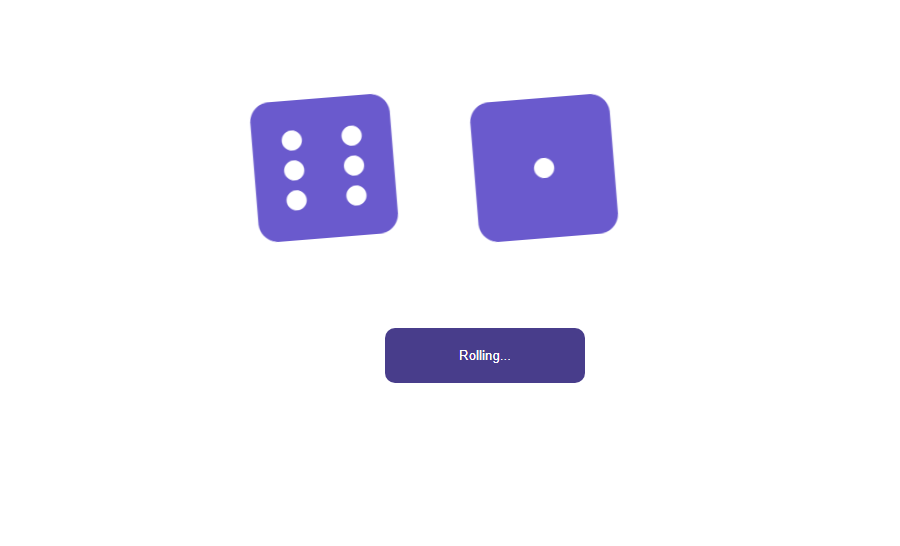

# Dice Game App in React

Dice Game it is a create react app. It was created for desktop views. It displaying two dices and button.
After click, button stay disabled for 1 second and at the same time two dices are rolling. After 1 second
button is avalible again to roll.

## Tools & Technology used

- Visual Studio Code
- React
- HTML
- CSS
- keyframes
- Css modules
- Flexbox
